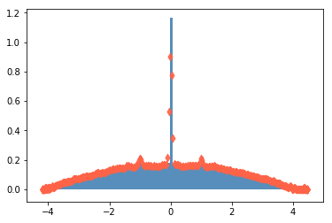

# 

eMaTe is a python package implemented in tensorflow which the main goal is provide useful methods capable of estimate spectral densities and trace functions of large sparse matrices. 

## Install                                                                                                              
```
pip install emate
```

## Kernel Polynomial Method (KPM)

The Kernel Polynomial Method can estimate the spectral density of large sparse Hermitan matrices with a computational cost almost linear. This method combines three key ingredients: the Chebyshev expansion + the stochastic trace estimator + kernel smoothing.


### Example

```python
import igraph as ig
import numpy as np

N = 3000
G = ig.Graph.Erdos_Renyi(N, 3/N)

W = np.array(G.get_adjacency().data, dtype=np.float64)
vals = np.linalg.eigvalsh(W).real
```

```python
from emate.hermitian import pykpm
from stdog.utils.misc import ig2sparse 

W = ig2sparse(G)

num_moments = 300
num_vecs = 200
extra_points = 10
ek, rho = pykpm(W, num_moments, num_vecs, extra_points)
```

```python
import matplotlib.pyplot as plt
plt.hist(vals, density=True, bins=100, alpha=.9, color="steelblue")
plt.scatter(ek, rho, c="tomato", zorder=999, alpha=0.9, marker="d")

```



## Stochastic Lanczos Quadrature (SLQ)


>The problem of estimating the trace of matrix functions appears in applications ranging from machine learning and scientific computing, to computational biology.[2] 

### Example

#### Computing the Estrada index

```python
from emate.symmetric.slq import pyslq
import tensorflow as tf

def trace_function(eig_vals):
    return tf.exp(eig_vals)

num_vecs = 100
num_steps = 50
approximated_estrada_index, _ = pyslq(L_sparse, num_vecs, num_steps,  trace_function)
exact_estrada_index =  np.sum(np.exp(vals_laplacian))
approximated_estrada_index, exact_estrada_index
```
The above code returns

```
(3058.012, 3063.16457163222)
```
#### Entropy
```python
import scipy
import scipy.sparse

def entropy(eig_vals):
  s = 0.
  for val in eig_vals:
    if val > 0:
      s += -val*np.log(val)
  return s

L = np.array(G.laplacian(normalized=True), dtype=np.float64)
vals_laplacian = np.linalg.eigvalsh(L).real

exact_entropy =  entropy(vals_laplacian)


def trace_function(eig_vals):
  def entropy(val):
    return tf.cond(val>0, lambda:-val*tf.log(val), lambda: 0.)
  
  return tf.map_fn(entropy, eig_vals)
 
L_sparse = scipy.sparse.coo_matrix(L)
    
num_vecs = 100
num_steps = 50
approximated_entropy, _ = pyslq(L_sparse, num_vecs, num_steps,  trace_function)

approximated_entropy, exact_entropy
```
```
(-509.46283, -512.5283224633046)
```
[[1] Hutchinson, M. F. (1990). A stochastic estimator of the trace of the influence matrix for laplacian smoothing splines. Communications in Statistics-Simulation and Computation, 19(2), 433-450.](https://www.tandfonline.com/doi/abs/10.1080/03610919008812866)

[[2] Ubaru, S., Chen, J., & Saad, Y. (2017). Fast Estimation of tr(f(A)) via Stochastic Lanczos Quadrature. SIAM Journal on Matrix Analysis and Applications, 38(4), 1075-1099.](https://epubs.siam.org/doi/abs/10.1137/16M1104974)


## Acknowledgements

This work has been supported also by FAPESP grants  11/50761-2  and  2015/22308-2.   Research  carriedout using the computational resources of the Center forMathematical  Sciences  Applied  to  Industry  (CeMEAI)funded by FAPESP (grant 2013/07375-0).
 

